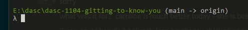

# DASC 1104 Programming Languages for Data Science
## Lab 02 (Part 1): "Git"ing to know you, "Git"ing to know all about you...

This lab will walk you through working with Git and Github. Remember, Git is a version control tool that helps track your changes as you develop and collaborate on projects.

### 1.	Join [Github](https://github.com/)
If you have never used Github before. Go to https://github.com/ and register for an account. Basic github accounts cost $Free Dollars$ and you will find yourself needing an account in future classes.

### 2. View the [repository](https://github.com/hrhames/dasc-1104-gitting-to-know-you).
In your browser, go to https://github.com/hrhames/dasc-1104-gitting-to-know-you  This is the repository for this lab. Remember a repository is where all of your files and changes (revision) are stored for a project. Click through the page and see what kind of files.

### 3. Open VS Code
Open a new instance of VS Code. VS code is a great editor because it has many integrated features that make code development easier. One particular feature is the integrated terminal. In the first unit of this course we learned that the terminal is a piece of text based software that lets you interact with your OS, and that there can be many types of terminals. The VSCode terminal feature works the same way, but is built in to the VS Code software so you don't have to switch between applications to work with the command line.

1. Open VS Code
2. Activate the terminal, by choosing **View > Terminal** from the top menu.

### 4. Clone the [repository](https://github.com/hrhames/dasc-1104-gitting-to-know-you).
Cloning is the act of copying the repository files to your local machine. This is done using the `$ git clone` command. Clone the repository using the following steps. 
   
1. Using the terminal create a directory on your machine for files related to this class, and change directory so that this new directory is your current working directory.  (`cd`,`mkdir`, and `pwd` will be useful here.)
2. Use `$ git clone https://github.com/hrhames/dasc-1104-gitting-to-know-you.git ` to clone the repository to your local machine.
3. Use the `cd` and `ls` commands to verify that the files have been copied to your machine. Do not close the terminal, we will continue using it in the subsequent steps.
4. `cd` into the 'dasc-1104-gitting-to-know-you' folder. Did anything change in your command prompt?
   
    Example of my command line:
   

### 4. Open the 'repo' folder in VS Code 
In VS Code, choose **File > Open Folder** from the top menu and navigate to the 'dasc-1104-gitting-to-know-you' folder and select it.  ...Yes, you trust the authors. I made this repo. I'm like your best friend. Trust me.
 ***Note:*** You may need to re-open your terminal using **View > Terminal**

### 5. Create a branch.
Right now we are located in the "main" branch of our repository. The main branch is generally considered to be the current source of truth for your projects, and it is generally considered bad practice to make changes directly to the main branch.  When working on a project and making changes, you want to create a new branch from the main so that you can make your changes without fear of corrupting the main branch if you make a mistake.

You can create another branch with the command line, using the following code `$ git branch [branch-name]`.  Use the terminal to create a branch that has the same name as your Uark username. 
 `$ git branch [your-uark-username]`

In the bottom left corner of VS Code, you can also see what branch you are currently working on. You can click on the branch name, and a list of options will show up in the command pallette. Feel free to use this method to create another branch.
 

### 6. Changing to a branch
A repository can have many branches at any given time. You can actually have more than one branch on your local machine, and you may need to switch between them. Let's change to a differnent branch
   1. Let's use the terminal to see a list of all branches all branches currently on your local machine with `$ git branch`
   2. Now, switch to the branch you made with your uark username with  `$ git switch [branch-name]`.
   
Everything should look the same.

### 7. Let's make some changes. 
Now that we have a branch, we can make changes to the project without messing things up for everyone! Woo.

1. Click on the file explorer icon   to view the files in your repo. 
2. Right click on the "sudent-files" folder and choose "New File". Name it [your-uark-username].md  (These are markdown files. I actually used one to make this instruction sheet.)
3. Open your newly made markdown file by clicking on it in the file explorer pane if it is not already open.
4. Make some changes. Something like the below would be acceptable if you can't think of anything to put in the file.
     
5. Save the file.

### 8. Commit the file to your local git revisions.
If you look to the left of your screen in VS Code, you should see something that look like this . This is the git icon. Click on it and you can see a list of your changes. You can also view your current git status on the command line using `$ git status`

Is your new file tracked or untracked?  What does that mean?

### 8. Add your file to the git staged files.
Adding your file to git means that the changes on your file will be tracked as part of the revision history of the project. (For this branch anyway).  You can add your files to git via commandline with `$ git add [your-file-name]` to add specific files, or `$ git add *` to add all files. (Hey look! The wild card *. We've seen that before.)  You can also add your files to staging throught he VS Code git GUI. Click on the + next to the file name to add it to the staged files.  

It's staged. That means the changes are saved in git right?  (hint: wrong)

### 9. Commit your files to git.
To save your changes and be able to send them to the remote repo, you need to COMMIT your changes to git. 
You can commit your changes in the command line with `$ git commit -m [commit message]` or you can commit your changes using the VS Code GUI

***Note:*** Your commit messages should be meaningful. Your collaborators need to know what your changes are for. "commit" is a terrible commit message. We know you commited changes Jordan, don't make me look through every file to see what you actually did!

### 10. Push your changes to the remote repository.
Great, you're commited. I am so happy for you and your choices. Here's the thing. You're only commited locally. So, if I come over to your area and launch your laptop across the room in a hulk like rage. All of you hard work is still for nothing because your changes weren't pushed to the cloud.

So let's fix that. You can push your changes via command line with `$ git push`.

### 11. Go back to the repository site on the web and see if you can find your branch.
https://github.com/hrhames/dasc-1104-gitting-to-know-you

That concludes part one. Stay tuned for part 2. Where we will learn how to pull down changes and merge them into our branch.